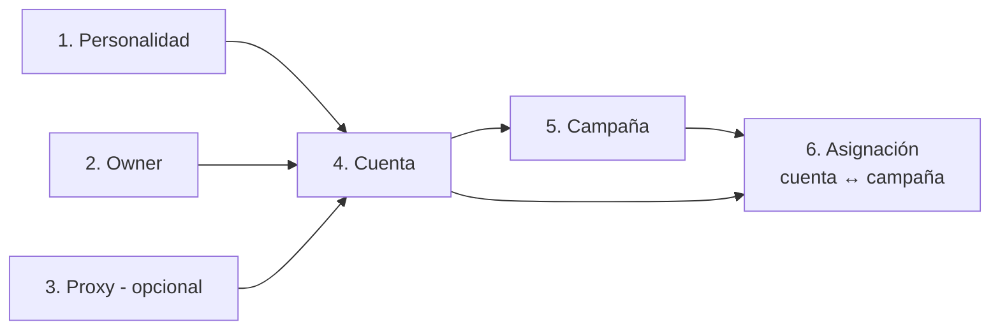

# Guía: crear una cuenta de Instagram

2026-09-24

## Resumen

Una cuenta de Instagram lista para prospectar necesita 6 registros (el proxy es opcional), creados en este orden porque cada uno usa el `id` del anterior. Todas las rutas cuelgan de `/api/`, reciben JSON (`Content-Type: application/json`) y hoy no exigen token.



| Paso | Método y ruta | Devuelve el id que usa |
| --- | --- | --- |
| 1 | `POST /api/bot_personalities/` | la cuenta (`bot_personality`) |
| 2 | `POST /api/account_owners/` | la cuenta (`owner`) |
| 3 | `POST /api/proxy/` | la cuenta (`proxy`) |
| 4 | `POST /api/social_media_accounts/` | la campaña y la asignación |
| 5 | `POST /api/prospecting/campaigns/` | la asignación (`campaign`) |
| 6 | `POST /api/prospecting/campaign-accounts/` | — |

## 1. Personalidad del bot

`POST /api/bot_personalities/` define el tono con que el bot comenta y responde. Todos los campos son opcionales; `language` vale `"ESPAÑOL"` si no se envía.

```json
{
  "name": "Laura - asesora cercana",
  "bio": "Asesora de belleza en Bogotá, habla con clientas a diario.",
  "location": "Bogotá, Colombia",
  "language": "ESPAÑOL",
  "communication_style": "Friendly",
  "values": "Honestidad, cercanía",
  "preferences": "Contenido de cuidado personal",
  "dislikes": "Spam, polémica",
  "example_responses": "¡Qué lindo resultado! 😍",
  "special_knowledge": "Tratamientos capilares",
  "cultural_references": "Expresiones colombianas",
  "phraseology": "¡Qué chimba!, parce",
  "past_interactions": "",
  "emotional_reactions": "Empática ante quejas",
  "objectives": "Generar confianza y conversación",
  "behavioral_tendencies": "Respuestas cortas, sin vender directo"
}
```

`name`, `location` y `language` admiten hasta 255 caracteres; el resto es texto libre. Guarda el `id` de la respuesta.

## 2. Owner (dueño o cliente)

`POST /api/account_owners/` registra el negocio al que pertenece la cuenta. Si luego se borra el owner, se borran sus cuentas.

```json
{
  "owner_name": "Salón Ejemplo",
  "owner_email": "contacto@ejemplo.com",
  "owner_phone": "+573001234567",
  "owner_urls": ["https://www.instagram.com/salon_ejemplo/"],
  "services": ["Alisado", "Coloración", "Manicure"]
}
```

| Campo | Tipo | Obligatorio |
| --- | --- | --- |
| `owner_name` | texto, máx. 255 | sí |
| `owner_email` | email válido | sí |
| `owner_phone` | texto, máx. 20 | sí |
| `owner_urls` | cualquier JSON o `null` | no |
| `services` | lista de textos | no (por defecto `[]`) |

## 3. Proxy (opcional)

`POST /api/proxy/` registra la IP por la que saldrá la cuenta. Cada proxy sirve a una sola cuenta: asignar el mismo a dos cuentas da error 400.

```json
{
  "ip_address": "192.168.10.25",
  "port": 8080,
  "username": "proxyuser",
  "password": "proxypass"
}
```

`ip_address` (IPv4 o IPv6, única) y `port` (entero positivo) son obligatorios; `username` y `password` pueden ir en `null`.

## 4. Cuenta de Instagram

`POST /api/social_media_accounts/` crea la cuenta y la enlaza con los ids de los pasos 1 a 3. La cuenta no guarda la plataforma; eso lo indican la campaña y la asignación.

```json
{
  "account_name": "salon_ejemplo_ig",
  "group": ["grupo_1"],
  "owner": 3,
  "bot_personality": 2,
  "proxy": 15,
  "account_kind": "business",
  "other_credentials": {
    "user": "salon_ejemplo_ig",
    "password": "xxxx",
    "cookie": []
  }
}
```

| Campo | Tipo | Obligatorio | Qué es |
| --- | --- | --- | --- |
| `account_name` | texto, máx. 255 | sí | Usuario de Instagram |
| `group` | cualquier JSON (no `null`) | sí | Agrupación libre, p. ej. `["grupo_1"]` |
| `owner` | id | sí | Paso 2 |
| `other_credentials` | objeto JSON (no `null`) | sí | `user`, `password` y `cookie` |
| `bot_personality` | id o `null` | no | Paso 1 |
| `proxy` | id o `null` | no | Paso 3 |
| `account_kind` | `"business"` o `"personal"` | no (por defecto `business`) | Tipo de cuenta |
| `access_token`, `access_secret` | texto o `null` | no | Campos heredados, no se usan |

`cookie` es una lista de cookies de navegador con `domain`, `name`, `value`, `path`, `httpOnly`, `secure`, `sameSite` y `expiry` (timestamp Unix o `null`). Se puede enviar vacía y cargarla después con `PATCH /api/social_media_accounts/{id}/update_cookie/`, cuyo cuerpo es la lista sola.

## 5. Campaña de prospección

`POST /api/prospecting/campaigns/` crea la campaña. Exige una cuenta principal (`social_media_account`), por eso va después del paso 4. Si no se envía el estado, queda en `draft`; el bot solo la usa cuando `status` es `"active"`.

```json
{
  "social_media_account": 25,
  "name": "Prospección salones Bogotá",
  "platform": "instagram",
  "status": "active",
  "services_snapshot": ["Alisado", "Coloración"],
  "strategy_snapshot": {},
  "business_description": "Salón de belleza en Chapinero",
  "business_hours": "Lun-Sáb 9:00-19:00",
  "follow_up_phone": "+573001234567",
  "follow_up_email": "contacto@ejemplo.com",
  "owner_instagram_profile_url": "https://www.instagram.com/salon_ejemplo/"
}
```

| Campo | Tipo | Obligatorio |
| --- | --- | --- |
| `social_media_account` | id (paso 4) | sí |
| `name` | texto, máx. 150 | sí |
| `platform` | `"instagram"` o `"facebook"` | sí |
| `status` | `draft`, `active`, `paused`, `completed`, `cancelled` | no (por defecto `draft`) |
| `services_snapshot` | lista JSON | no (por defecto `[]`) |
| `strategy_snapshot` | objeto JSON | no (por defecto `{}`) |
| `business_description`, `business_hours` | texto o `null` | no |
| `follow_up_phone` | texto, máx. 50, o `null` | no |
| `follow_up_email` | email o `null` | no |
| `owner_instagram_profile_url` | texto o `null` | no |

Para cambiarla se usa `PATCH /api/prospecting/campaigns/{id}/`; este endpoint no acepta `PUT`.

## 6. Asignar la cuenta a la campaña

`POST /api/prospecting/campaign-accounts/` es el paso que hace que el bot encuentre la campaña. El bot busca la campaña activa por esta tabla, no por el campo `social_media_account` del paso 5, así que sin este registro la cuenta no prospecta.

```json
{
  "campaign": 7,
  "social_media_account": 25,
  "platform": "instagram",
  "role": "prospecting",
  "is_active": true,
  "daily_limit": 20,
  "total_limit": 500
}
```

| Campo | Tipo | Obligatorio |
| --- | --- | --- |
| `campaign` | id (paso 5) | sí |
| `social_media_account` | id (paso 4) | sí |
| `platform` | texto | no (por defecto `"instagram"`) |
| `role` | solo `"prospecting"` | no (por defecto `"prospecting"`) |
| `is_active` | booleano | no (por defecto `true`) |
| `daily_limit`, `total_limit` | entero positivo o `null` | no |

Una misma cuenta no puede asignarse dos veces a la misma campaña, pero sí a varias campañas. Varias cuentas pueden compartir una campaña con un registro por cuenta.

## Errores comunes y verificación

Para confirmar que todo quedó bien, llama a `GET /api/prospecting/campaigns/active/?social_media_account_id=25&platform=instagram`. Si responde `"ok": true` con la campaña, la cuenta está lista; si da 404, revisa los puntos de abajo.

| Síntoma | Causa |
| --- | --- |
| 404 en `/active/` | Falta el paso 6, la asignación tiene `is_active: false` o la campaña no está en `"active"` |
| 400 al crear la cuenta con `proxy` | Ese proxy ya está asignado a otra cuenta |
| 400 "This field is required" en la cuenta | Falta `group`, `owner`, `account_name` u `other_credentials` |
| 400 en `account_kind` o `platform` | Valor fuera de los permitidos |
| 400 "Esta cuenta ya está asignada a esta campaña" | La pareja cuenta–campaña ya existe; usa `PATCH` sobre ese registro |

Para ver la cuenta con owner, proxy y personalidad expandidos: `GET /api/social_medias/{id}/`.
